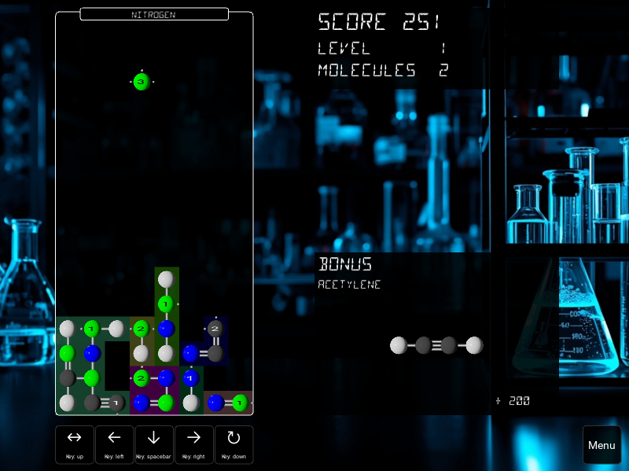
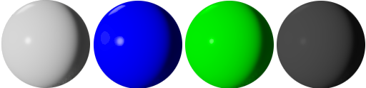
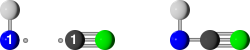
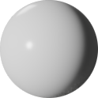
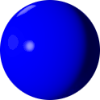
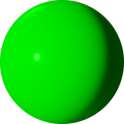
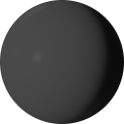

# CHON

CHON is a Python-based atomic puzzle game. Knowledge of chemistry is NOT required.



## Get CHON
### From binaries
Download the provided binaries for your system (if available). CHON can 
directly be executed. No install required.

### From source
#### Requirements
* Python >= 3.8
* Kivy >= 2.2.0

It is recommended to install kivy into a virtual environment (venv). 
See below.

#### Get source
Download the content of this repository or (recommended) clone this 
repository:
```
git clone https://github.com/sjaehn/chon
```

#### Get kivy
If not globally installed yet, the installation of kivy into a virtual
environment (venv) is recommended. Also see: 
https://kivy.org/doc/stable/gettingstarted/installation.html

#### Run 
Run `chon.py` by:
```
python chon.py
```
With `python` may be replaced by another symbol (e.g., `py`, `python3`)
depending on your system.

#### Optional: Build
Requirements:
* pyinstaller

You can use `pyinstaller` to create a single file binary using the 
provided .spec file. Call from the chon folder:
``` 
pyinstaller chon.spec
```

After build, you will find the binary in the `dist` folder.

## Playing
Complete molecules by connecting atoms and molecule fragments until all 
free electrons are paired!

Molecules consist of atoms (</img>) 
and bonds (</img>) . Up to
three bonds are allowed between two atoms. 


Incomplete molecules also have got atoms with free electrons rotating 
around the atom. 


The number of free electrons is shown for each atom. 

Free electrons can 
form a bond when paired with free electrons of atoms of other 
incomplete molecules. Combine two or more incomplete molecules to pair 
their free electrons by placement of the respective atoms next to each 
other. 



Move the falling molecule fragment horizontally to the right position. You
can also rotate and/or horizontally flip the fragment. Then you can 
optionally drop it and the molecule fragments in the reactor are combined,
if possible. Complete molecules are converted into points and will be 
removed from the reactor. 

### Controls
You can play the game using your keyboard, joystick, gamepad, mouse or 
touch device (see Settings below).

### Atoms, electrons and bonds:
There are 4 types of atoms in the game:
* Hydrogen (H, </img>): 1 electron
* Oxygen (O, </img>): 2 electrons
* Nitrogen (N, </img>): 3 electrons
* Carbon (C, </img>): 4 electrons

### Take in account:
* If you place two atoms with free electrons next to each other, 
then the max possible number of bonds is formed.
* Once a connection is created, it will remain as it is. You can't split 
a bond anymore.
* Omit to leave free electrons at positions where they can not be
reached anymore.

### Scores:
There are three ways to get points:
* Drop atoms/fragments: 1 pt. for each line dropped
* Complete a molecule: Sum of all values of connected fragments 
  (multiples of 10)
* Get bonus by completion a molecule which equals the bonus molecule: 
  multiples of 100

Good luck!

## Settings
### Controls
You can re-define controls for horizontal movement, rotation, flip, 
and drop. Press \<set\> followed by any input device action. Or use the
default settings for your input device. Supported input devices are 
keyboard, joysticks, gamepads, mouse and touch devices.

### Audio
Bugged by the default soundtrack? Choose another playlist.

## Implemented features
* [x] Gameplay
* [x] Bonus incl. isomery detection algorithm
* [x] Default keyboard controls
* [x] Optional mouse/touch controls
* [x] Optional joystick/gamepad support
* [x] Custom user configs
* [x] Menu navigation via touch, mouse, keys, or joystick
* [x] SFX, music playback
* [x] High score table

## TODO
* [ ] Auto detect input devices
* [ ] Prepare mobile version
* [ ] Add build workflow

## License
### Software
See LICENSE.

### Assets
All sounds and images provided in this repository are either not eligible
to copyright or granted to free use:
* Sound effect `boom.wav` from https://freesound.org/search/?q=825053 as 
[CC0](https://creativecommons.org/publicdomain/zero/1.0/legalcode).
* Other sound effects (`inc/*.wav`) are synthesized by sjaehn and 
granted as 
[CC0](https://creativecommons.org/publicdomain/zero/1.0/legalcode).
* The tracks of "Mendeleev's playlist" (`inc/mu_01_*.ogg`) are 
interpretations of classic russian folk songs (Kohanochka, Karapyet, 
Troika; all before 1900) by sjaehn and granted as 
[CC0](https://creativecommons.org/publicdomain/zero/1.0/legalcode).
* All tracks of "Chemystery" by sjaehn and granted as 
[CC0](https://creativecommons.org/publicdomain/zero/1.0/legalcode).
* All game item images (`inc/*.png`) by sjaehn and granted as 
[CC0](https://creativecommons.org/publicdomain/zero/1.0/legalcode).
* All background images (`inc/*.jpg`) are AI generated and thus not 
eligible to copyright.

Fonts used in this game are free to use under the following conditions:
* [Font OpenArrow by Heeyeun : MIT license](/inc/LICENSE.OpenArrow.md) from 
https://github.com/yeun/open-arrow/
* [Font Segment14 by Paul Flo Williams: OFL License](/inc/LICENSE.segment14.md) 

